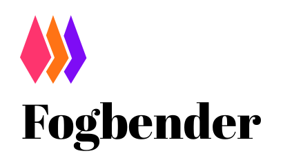

### Fogbender is an open-source customer communication system

- Conceptually, it's a hybrid between Slack Connect and Intercom: you can embed a messaging widget on your customer-facing dashboard, but expose it to the whole customer team (account), instead of just individuals
- It can also be configured to support website visitors (pre-authentication)
- Conversations can be turned into issues - essentially named threads - and optionally associated with new or existing tickets in an external tracker, such as Linear, Height, Jira, GitHub, etc.
- Fogender can be used as an alternative to a team messaging system, for internal communication
- Agent Slack integration can be used to monitor all conversations in a single channel, where each issue is turned into a thread. The integration is bi-directional - it's possible to respond from Slack
- The same agent Slack integration can be used to connect existing shared channels to customers in Fogbender
- Customer Slack integration can be used to connect a customer in Fogbender to a channel in a customer's Slack workspace - without using Slack Connect
- A Microsoft Teams integration can be used to connect a customer in Fogbender to a channel in a customer's Microsoft Teams team

# Giving it a go

## Easy: Fogbender Cloud

https://fogbender.com is a hosted version of Fogbender operated by the authors of the project, who recently (July 2023) managed to get Fogbender through SOC2 (Type I) compliance certification.

[Pricing](https://fogbender.com/pricing) summary:

- Free tier is limited to two customer-facing agents
- You can have any number of Readers: agents with read-only access to customer conversations, but full write access to internal conversations
- Unlimited end-users
- Unlimited messages and files
- Note: we're using some non-free APIs for AI, IP geolocation, and contact enrichment - we plan on introducing a base price for features that use these APIs, to help us cover the bills

## Medium: Get it running locally

1.  Install [Nix](https://nixos.org/nix/download.html):

        curl -L https://nixos.org/nix/install | sh

2.  Clone the repo

        git clone https://github.com/fogbender/fogbender.git && cd fogbender

3.  Generate token/session secrets. This will write the secrets to a Git-ignored `local.env` file:

        ./scripts/oss-make.sh fog-secrets

Note: do this ^^ once

4.  Start the backend:

        ./scripts/oss-make.sh fog-secrets

Is it running? Check here: http://localhost:8000/admin

5.  Start the frontend (use a second terminal):

        ./scripts/oss-make.sh web-start

The above will start 3 apps on different ports:

- http://localhost:3100 - local version of https://fogbender.com
- http://localhost:3200 - local version of https://demo1.fogbender.com/
- http://localhost:3300 - local version of https://client.fogbender.com (embeddedable widget - won't load without a token)

6.  Now you can use Fogbender just like you would on https://fogbender.com, except some features will be turned off or mocked:

    - Intergrations with 3rd party services (like Stripe, Slack, GitHub, etc), Google login, AWS Cognito are turned off (you need to configure secrets in the `local.env` file to enable them)
    - File upload is mocked (will upload files to the local filesystem - `.nix-shell/files` - instead of S3)
    - You can't receive or send emails (http://localhost:8000/public/emails will work for debugging local sending)

7.  Optional: To get access to Fogbender root organization, do the above, sign up, then run

        ./scripts/oss-make.sh fog-agent-boot

Once you do this, you'll see the "Fogbender" organization under http://localhost:3100/admin - this way, you can answer your own support questions.

### Working with the Database

Starting the backend server will automatically create and start a local PostgreSQL database. For `psql` access, run

    ./scripts/oss-make.sh db-repl

To stop the database, run

    ./scripts/oss-make.sh db-stop

To reset the database (WIPING ALL DATA) run

    ./scripts/oss-make.sh db-clean

## Hard: Host it in your cloud

We host Fogbender in AWS and use [Pulumi](https://www.pulumi.com) for IaC and [SOPS](https://github.com/getsops/sops) with AWS KMS for secrets management.

Our plan is to develop a tutorial (or CLI) to serve as a guide; meanwhile, we'd be happy to walk you through it via support on Fogbender Cloud: https://fogbender.com/admin/-/support.
